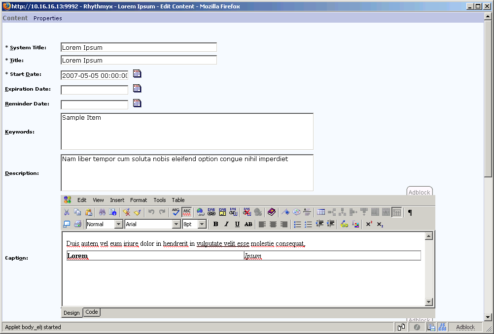
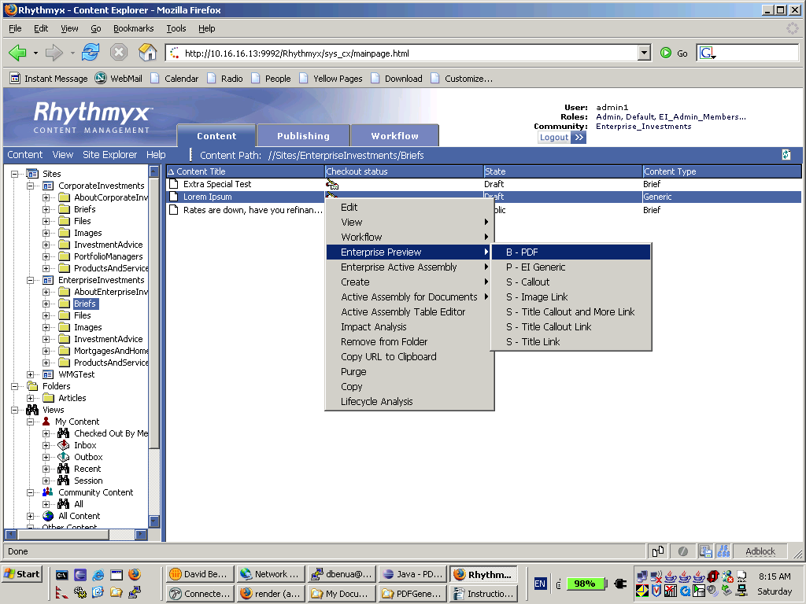
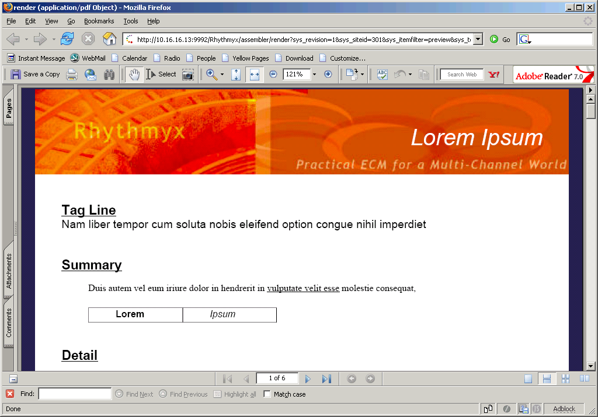
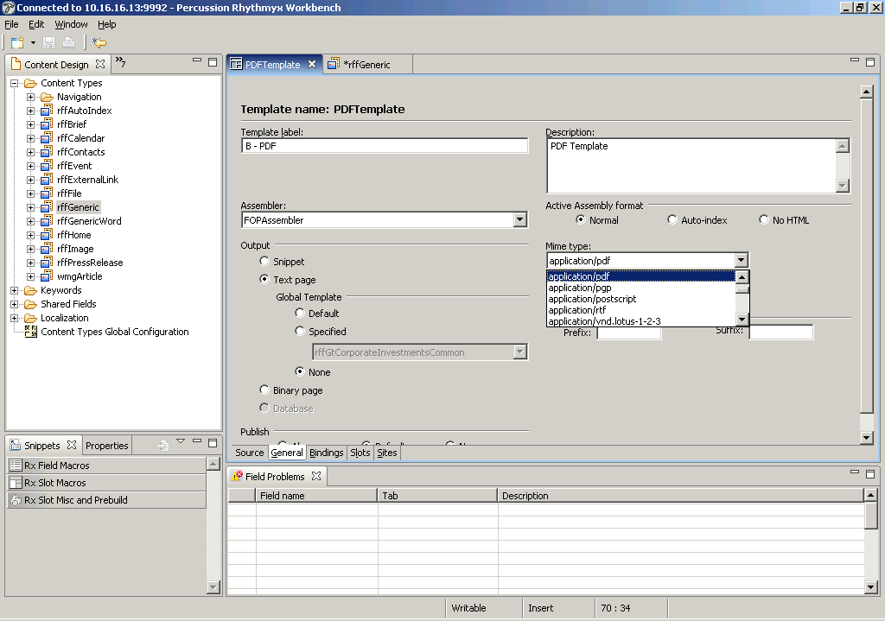
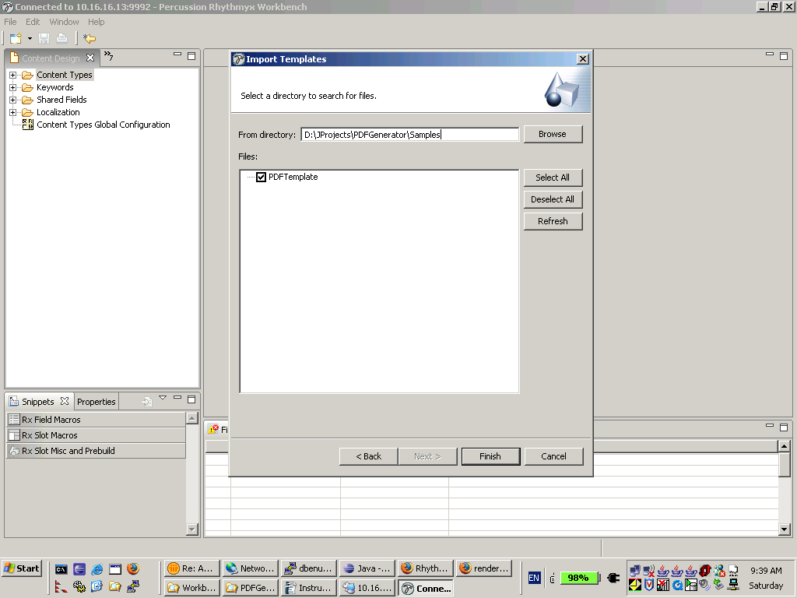
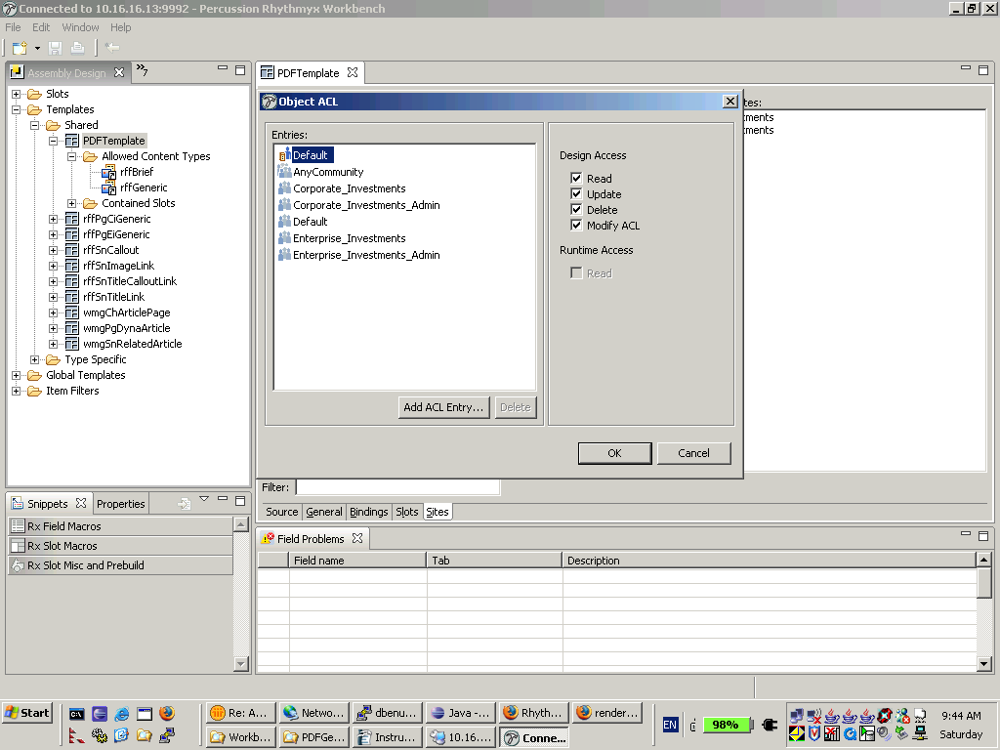
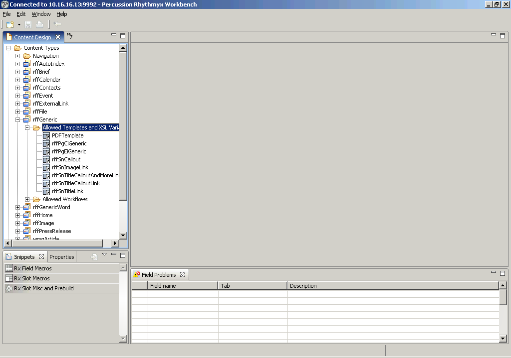
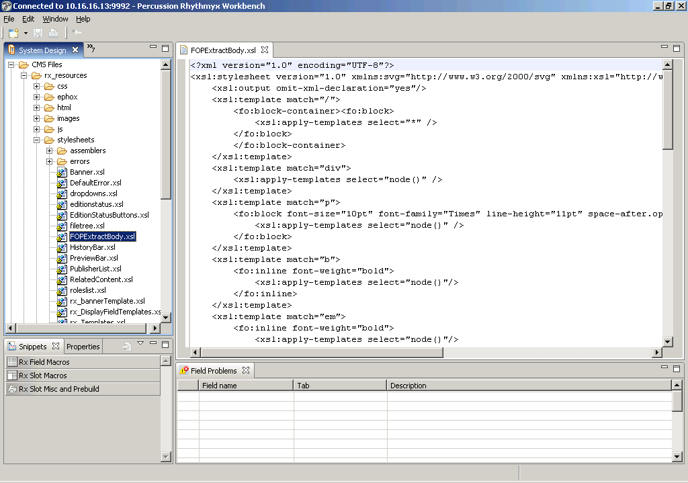

# Percusion CMS PDF Assembler

Welcome to the Percussion CMS PDF Assembler.

The PDF Assembler is used to assemble content into PDF, Postscript and other common printable formats, using the Apache FOP processor. The user can create templates that take full advantage of XSL FO without having to write (or debug) large amounts of XSLT.

Contributors use normal Percussion content types, and enter their content using the normal editor controls.  Implementers define one or more FOP Templates that produce the proper output format for that particular content type. Since these are ordinary Percussion templates, multiple templates can be created with different formats as required.

#### Example

We have built a simple example using the Fast Forward content types.  The contributor enters the content item using the Generic Content Editor.

Using the Content Explorer, the user can then preview the content item with the PDF template.

This results in a PDF displaying on the screen.

### Adding MIME types to the Workbench

The PDF Assembler as deployed by the deployment script supports the following MIME types:

- application/pdf
- application/postscript
- application/x-pcl
- text/plain
- text/richtext
- text/rtf
- application/rtf
- image/png

The standard Workbench installation does not include all of these types in the **MIME Type** drop down control.

## Importing the Sample Templates (Optional)

### PDF Sample

A sample PDF template is included for reference in the *rx_resources/fop-assembler/Samples* directory.

Open the Workbench and select the **Content Design** view and use the **File – Import** menu to import Templates. Use the **Browse** button to locate the sample *PDFTemplate.template*.

*Note that if you are using 2 different machines, this is relative to the workbench, not the Server.*

Select the **PDFTemplate** entry. Once you press the **Finish** button, the template will appear in the **Assembly Design** view.

You must add your new template to the appropriate Communities.

- Right-click on the template and open the **Security** dialog.
- Add any communities, and check the **Read** box.

You must also add the template to the **Allowed Templates** of any Content Types (in this example **rffGeneric**).

- In the Assembly design view, Select **PDFTemplate** and **Copy** it (with ctrl-C).
- Switch to the **Content Design** view, and expand **Generic**.
- Click on the **Allowed Templates and XSL Variants** and Paste. This will add **PDFTemplate** to the list of allowed templates.

You are now ready to use the sample template.

### PNG Sample

A sample PNG template is included for reference in the *Samples* directory. Install and configure the PNG template using the process described above for the PDF template.

## Extending the Sample Template

### Changing the MIME Type

The sample template is configured to supply PDF output. You can change this by selecting a different type (such as `application/postcript`) and then previewing a Generic content item. Save the output to disk and open it in your favorite text editor.

### Template Source

Examine the template source. You will notice that it returns XML using the FO namespace. Apache and the W3C maintain extensive references and tutorials on FO. We are using FOP version 0.93, but expect that the FOP Assembler will be upward compatible with future versions.

Notice that Static Images can be referenced in the template. Place your images in the *rx_resources* folder.

    <fo:static-content flow-name="xsl-region-before">
        <fo:block>
            <fo:external-graphic src="rx_resources/images/PDFmarginTop.jpg" content-width="20cm"/>
        </fo:block>
    </fo:static-content>

### Bindings

Examine the bindings of the Sample template. You will notice that both the **callout** and **body** fields are processed with **psoTransform**. If your content types have additional fields, you can add them to the bindings. Give each new field a unique name.

### Editing XSL Stylesheets

The XSL Stylesheet provided with the sample supports simple formatting (bold, italics, underline), as well as tables and images. It can be extended to include other types of processing. The Antenna House XSL FO Tutorial contains more sophisticated stylesheets for processing XHTML to FO. See the References section below.

You can edit the XSL directly within the Workbench. Go to the System Design view, expand **CMS Files** and then **rx_resources** and then **stylesheets**. By default this will open in the Text editor, but you can configure your workbench to use any editor for XSL files using the Eclipse Preferences menu.

## References

- **Apache FOP Website:** <http://xmlgraphics.apache.org/fop/>
- **W3C FO Specification:** <http://www.w3.org/TR/2001/REC-xsl-20011015/>
- **XSL FO Tutorial:** <http://www.antennahouse.com/XSLsample/XSLsample.htm>
